# Split-Flap Building Instructions

**Author:** David Königsmann  
**Date:** April 29, 2022

---

## Table of Contents

1. [Introduction](#1-introduction)
2. [Hardware](#2-hardware)
   - 2.1 [General electronics](#21-general-electronics)
   - 2.2 [Screws](#22-screws)
   - 2.3 [Power Consumption](#23-power-consumption)
3. [PCBs](#3-pcbs)
   - 3.1 [Bill of Materials](#31-bill-of-materials)
   - 3.2 [Schematic](#32-schematic)
   - 3.3 [Soldering PCBs](#33-soldering-pcbs)
     - 3.3.1 [First unit](#331-first-unit)
     - 3.3.2 [All other units](#332-all-other-units)
4. [Printed parts](#4-printed-parts)
   - 4.1 [Flaps](#41-flaps)
5. [Assembly](#5-assembly)
   - 5.1 [Drum and Flaps](#51-drum-and-flaps)
   - 5.2 [Units](#52-units)
     - 5.2.1 [Cables](#521-cables)
     - 5.2.2 [Unit Assembly](#522-unit-assembly)
   - 5.3 [Case](#53-case)
     - 5.3.1 [MiddleFrame](#531-middleframe)
     - 5.3.2 [FrontCover](#532-frontcover)
     - 5.3.3 [BackCover](#533-backcover)
6. [Code](#6-code)

---

**Support the project:** If you would like to support my projects and help me buy more electronics:  
https://www.paypal.me/davidkoenigsmann

---

## 1 Introduction

Welcome to the documentation of my split-flap display.

This split-flap display sets itself apart by being almost completely 3D-printed. The flaps are printed by changing the color mid-print and mid-layer. The case is also completely 3D-printed.

If you really want to build one consider that it requires a lot of screws, heat-set inserts, many hours of printing and some electronics. The PCB also has a few SMD parts. Smallest component size is 0805. Some soldering experience is necessary. **Please try printing the flaps first, they are the most challenging to print.**

### General info about display:

- 10 units (PCB design allows up to 16)
- 45 flaps per unit
- Size: 513 mm x 136 mm x 138 mm

**3D-Files on Prusaprinters:** https://www.prusaprinters.org/prints/69464-split-flap-display  
**Github link to code:** https://github.com/Dave19171/split-flap

---

## 2 Hardware

### 2.1 General electronics

All quantities are for the 10-unit display. Amazon/Ebay/Aliexpress URLs are just examples and are interchangeable with similar products. I can not guarantee that the URLs point to the correct product. Please double check.

- Black filament, I used around 2.6 kg of PLA
- White filament, I used around 250 Grams of PLA
- **10 of 12V 28BYJ-48 stepper motor** - **IMPORTANT! ONLY 12V STEPPERS WILL WORK!**
- 10 of KY-003 5V momentary (not the latching ones) hall sensor with PCB  
  https://www.aliexpress.com/item/32661635775.html
- 10 of 2x1 mm disk neodymium magnet  
  https://www.ebay.de/itm/184668664439?var=692394581260
- 14 of M3 heat-set threaded insert  
  https://www.amazon.de/gp/product/B08BCRZZS3/
- 20 of M2 heat-set threaded insert  
  https://www.amazon.de/gp/product/B088QJG676/
- 22 AWG silicone wire  
  https://www.amazon.de/gp/product/B07W5ZMBYL/
- 26 AWG stranded wire, two colors
- 1 rocker switch  
  https://www.amazon.de/dp/B076GXD7XN/
- 1 DC socket for <9 mm hole size
- 1 12V >24 Watts power supply
- For PCB components see PCB section

### 2.2 Screws

This display requires a lot of different screws. I made a table to quickly see where the screw types go and how many you need.

| Screw Type | UnitFrame | Stepper | HallSensor | PCB | FlapDrum | MiddleFrame | FrontCover | BackCover | Total |
|------------|-----------|---------|------------|-----|----------|-------------|------------|-----------|-------|
| M4 Nut | | | | | | 4 | | | 4 |
| M3 Nut | | | | | | 20 | 8 | 4 | 32 |
| M4x8 mm Panhead | 20 | | | | | | | | 20 |
| M4x20 mm Panhead | | | | | | 4 | | | 4 |
| M3x16 Socket Cap Hex | | | | | | 20 | 6 | 8 | 34 |
| M3x8 Panhead | | | | | | 8 | 4 | | 12 |
| M3x6 mm | | | | 20 | | | | | 20 |
| M2x8 mm Panhead | | | | 20 | | | | | 20 |
| M2x4 mm | | | | 20 | | | | | 20 |
| M3 Heat Insert | | | | | | 8 | 6 | | 14 |
| M2 Heat Insert | | | | 20 | | | | | 20 |

**Table 1:** Screw sizes, quantity and assignment to part group

### 2.3 Power Consumption

I desoldered the power LED on the Arduinos to save more power.

#### Here are the stats on power consumption per Unit:

- 13 mA at 12V = 0.15 Watt per Unit when idle
- 186 mA at 12V = 2.22 Watts per Unit when actively flipping
- 90 mA at 12V = 1.08 Watt for the ESP01 (always on)

#### For a 10-Unit display including the ESP01:

- 220 mA at 12V = 2.63 Watts when idle
- 1.73 A at 12V = 20.76 Watts with all units flipping at the same time

---

## 3 PCBs

Use the gerber files from github and get 10 PCBs manufactured.

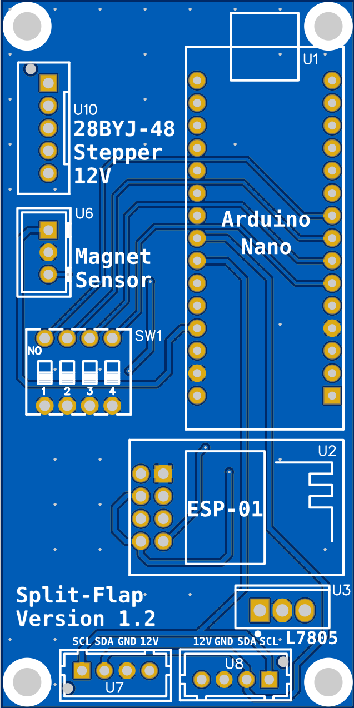

**Figure 1:** Split-Flap PCBs front and back side

### 3.1 Bill of Materials

- Get an assortment of JST-XH connectors and the correct crimping tool, you need:
  - 10x XH-3A
  - 20x XH-4A
  - 10x XH-5A
  - 10x XH-3Y
  - 19x XH-4Y  
  https://www.amazon.de/gp/product/B07VW8F1NB/
- Either get a bunch of single row female headers with 2.54 mm pitch and cut them to length or get the following lengths:
  - 20 x 15 Pins 1 Row
  - 1 x 4 Pins 2 Rows

All resistors and capacitors are 0805 size.

| ID | Name | Designator | Quantity | LCSC Number | Total |
|----|------|------------|----------|-------------|-------|
| 1 | ESP-01 | U2 | 1 | | 1 |
| 2 | 10K Resistor | R1,R2,R3,R4 | 4 | C269742 | 4 |
| 3 | BSS138 | Q1,Q2 | 2 | C78284 | 2 |
| 4 | 330nF | C1 | 1 | C527609 | 10 |
| 5 | Arduino Nano | U1 | 1 | | 10 |
| 6 | 100nF | C2 | 1 | C521242 | 10 |
| 7 | AMS1117-3.3 | U9 | 1 | C6186 | 1 |
| 8 | JST-XH-5A | U10 | 1 | C161872 | 10 |
| 9 | L7805CV | U3 | 1 | C111887 | 10 |
| 10 | ULN2003A | U4 | 1 | C107221 | 10 |
| 11 | 22 µF | C5 | 1 | C503893 | 1 |
| 12 | JST-XH-3A | U6 | 1 | C144394 | 10 |
| 13 | JST-XH-4A | U7,U8 | 2 | C161871 | 20 |
| 14 | DSWB04LHGET | Sw1 | 1 | C964138 | 10 |

**Table 2:** Bill of Materials

### 3.2 Schematic

**Figure 2:** PCB Schematic

### 3.3 Soldering PCBs

Every PCB needs the ULN2003A, the L7805 5V regulator, JST-XH sockets, female row headers for the Arduino and the DIP switch.

#### 3.3.1 First unit

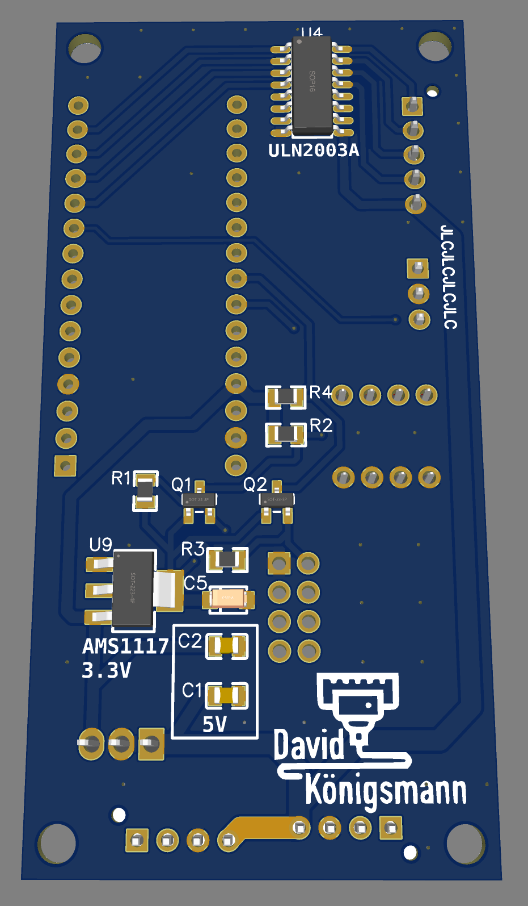

**Figure 3:** PCB back side with all components for first unit

The first unit has the ESP-01 and therefore needs a 3.3V regulator, level shifter and pull-up resistors for I2C communication. Populate the back side of the first unit with every component.

#### 3.3.2 All other units

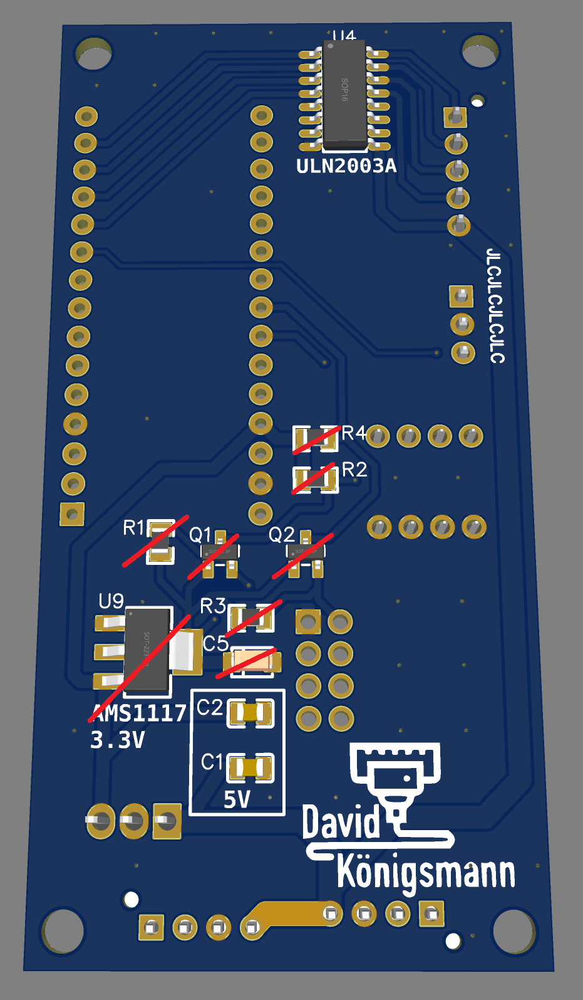

**Figure 4:** PCB back and front side with components for second unit onward

All other units do not need 3.3V. Just solder the two capacitors for the 5V circuit indicated by the silkscreen.

---

## 4 Printed parts

**3D-Files on Prusaprinters:**  
https://www.prusaprinters.org/prints/69464-split-flap-display

**Required printed parts:**

- 10 x FlapDrumInner
- 10 x FlapDrumOuter
- 10 x FrameUnit
- 1 x MiddleFrameLeft
- 1 x MiddleFrameCenter
- 1 x MiddleFrameRight
- 1 x FrontCoverLeft
- 1 x FrontCoverCenter
- 1 x FrontCoverRight
- 1 x BackCoverLeft
- 1 x BackCoverCenter
- 1 x BackCoverRight

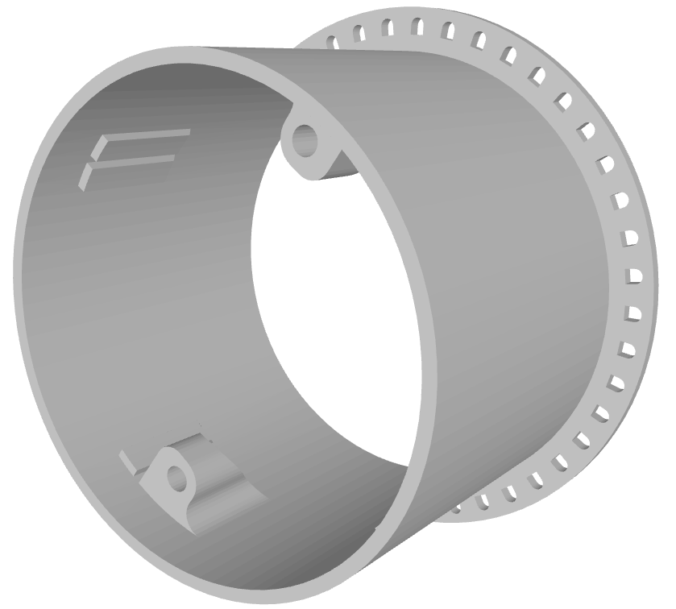

**Figure 5:** Overview printed parts

For the cover and frame parts I recommend a 0.6 mm nozzle and >0.3 mm layers. The bigger layer height accelerates printing and provides more strength. Maybe use a brim.

### 4.1 Flaps

**Try printing a few flaps first! These are the most challenging to print.**

The flaps are printed by changing the color several times mid-print. I provided .3mf files for easy printing on Prusa machines or if you are using PrusaSlicer. Print 10 of each flap.

If you do not need the Umlauts (ÄÖÜ) you can print the flaps with "noum" at the end of their name instead. This way you get the following three symbols: $ & #

**Pro tip:** If you open the resulting gcode with a text editor and delete the first M600 instruction, you don't have to change filaments every time the print starts.

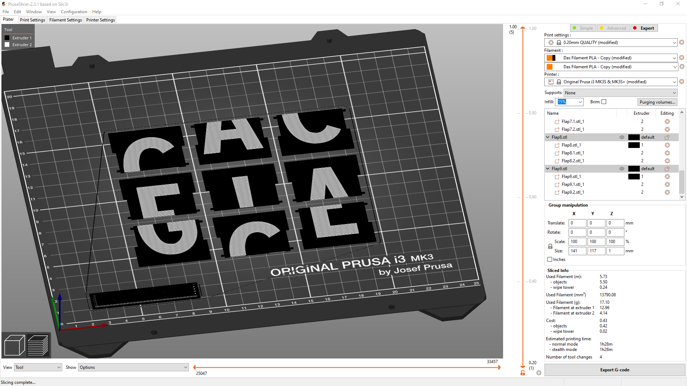

**Figure 6:** Flaps in PrusaSlicer

In case you want to make the flaps some other way, here are the measurements. Thickness is 1 mm. Font is Expressway Condensed Bold.

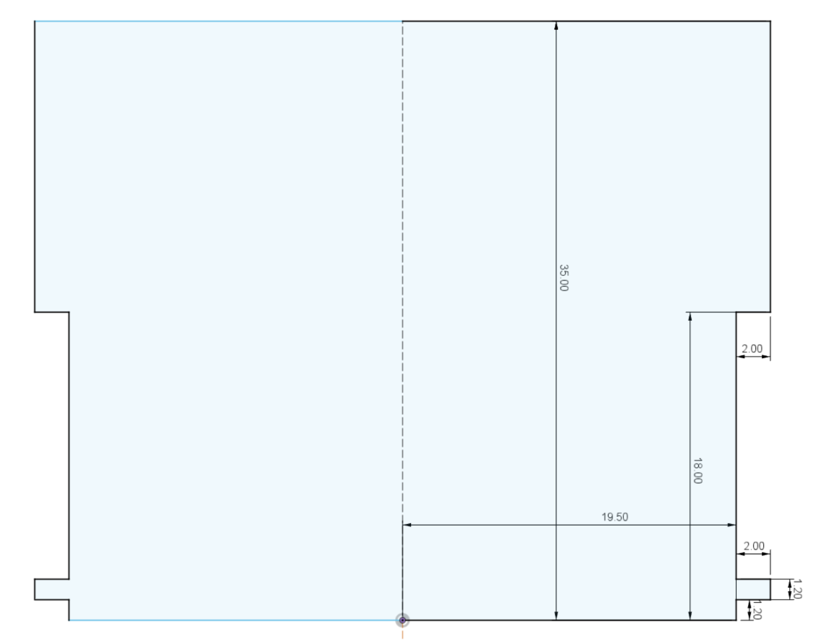

**Figure 7:** Flap measurements in millimeters

**Flap order:**

With Umlauts: ' ', 'A', 'B', 'C', 'D', 'E', 'F', 'G', 'H', 'I', 'J', 'K', 'L', 'M', 'N', 'O', 'P', 'Q', 'R', 'S', 'T', 'U', 'V', 'W', 'X', 'Y', 'Z', 'Ä', 'Ö', 'Ü', '0', '1', '2', '3', '4', '5', '6', '7', '8', '9', ':', '.', '-', '?', '!'

Or if you are using the alternative "noum" flaps: ' ', 'A', 'B', 'C', 'D', 'E', 'F', 'G', 'H', 'I', 'J', 'K', 'L', 'M', 'N', 'O', 'P', 'Q', 'R', 'S', 'T', 'U', 'V', 'W', 'X', 'Y', 'Z', '$', '&', '#', '0', '1', '2', '3', '4', '5', '6', '7', '8', '9', ':', '.', '-', '?', '!'

---

## 5 Assembly

### 5.1 Drum and Flaps

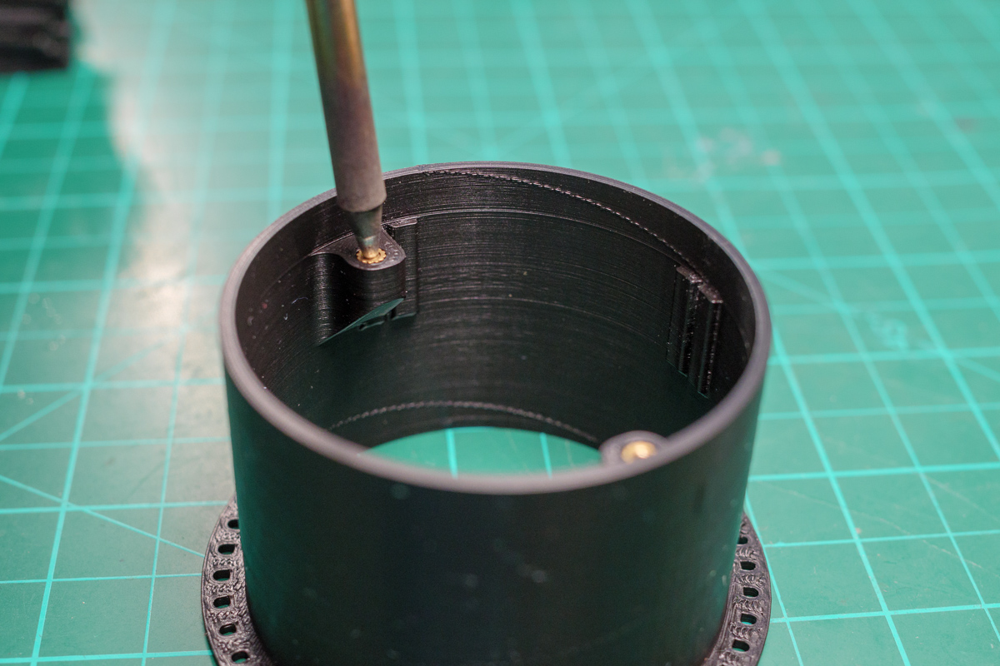

**Figure 8:** Drum Insert Installation

Press two drum pieces together. It is a friction fit, a bit of force may be required. After that, the two halves should stay together but can also be separated. Heat up your soldering iron to 200 °C and press the two inserts in.

Before you glue the magnet you have to figure out which way it is supposed to go. Supply one of the hall sensors with 5V and test to which side the little red LED reacts. If it turns on you have found the correct orientation. It is good practice to mark the correct pole of the magnet with a permanent marker. Then glue the magnets in the hole of the FlapDrumInner part.

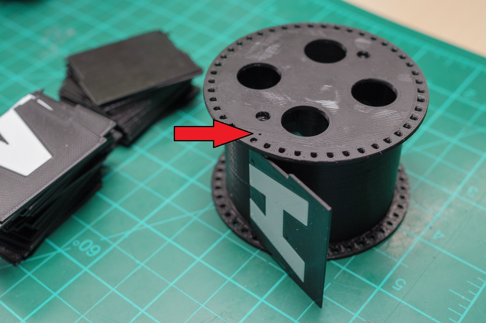

**Figure 9:** Flap Installation

Now you can install the flaps. Take a closer look at the two drum parts. On each side there is a small circle on the bottom that indicates the position of the first flap. These should be aligned on both pieces. The first flap is the one which is blank on one side and has the bottom of the A on the other. Lift the outer drum part a bit, insert some flaps, press it together again and repeat.

Secure the drum with two screws.

### 5.2 Units

#### 5.2.1 Cables

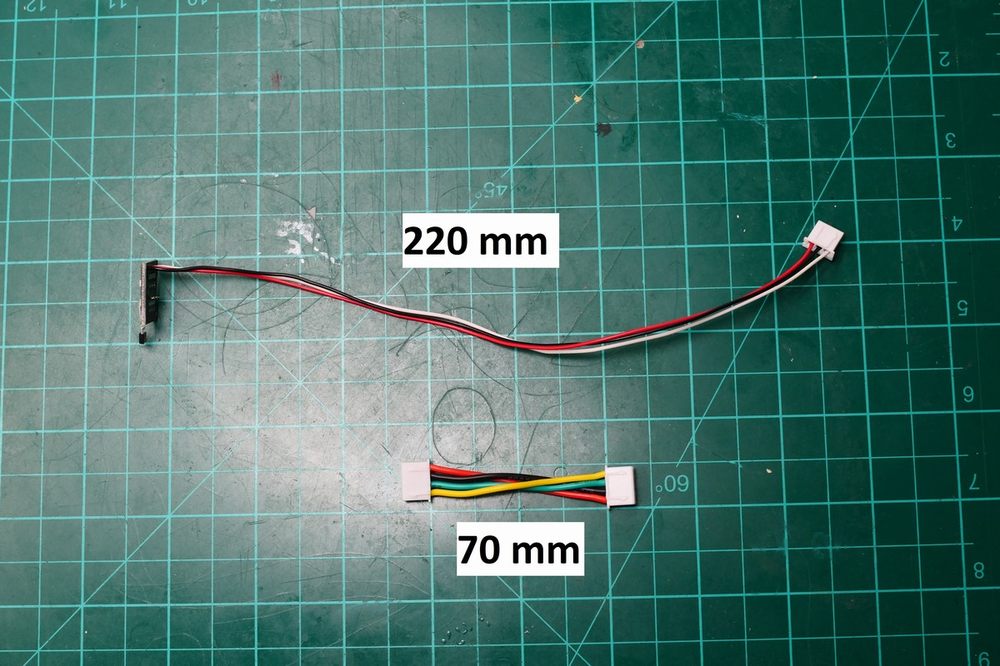

**Figure 10:** Cable lengths

- Prepare 9 cables with 4 x 70 mm wires each and XH-4P plugs on both sides
- Prepare one cable with just one plug and two power wires and connect them to the switch and DC socket
- Solder 3 x 220 mm wires to the hall sensor PCB and crimp a XH-3Y plug on the end

#### 5.2.2 Unit Assembly

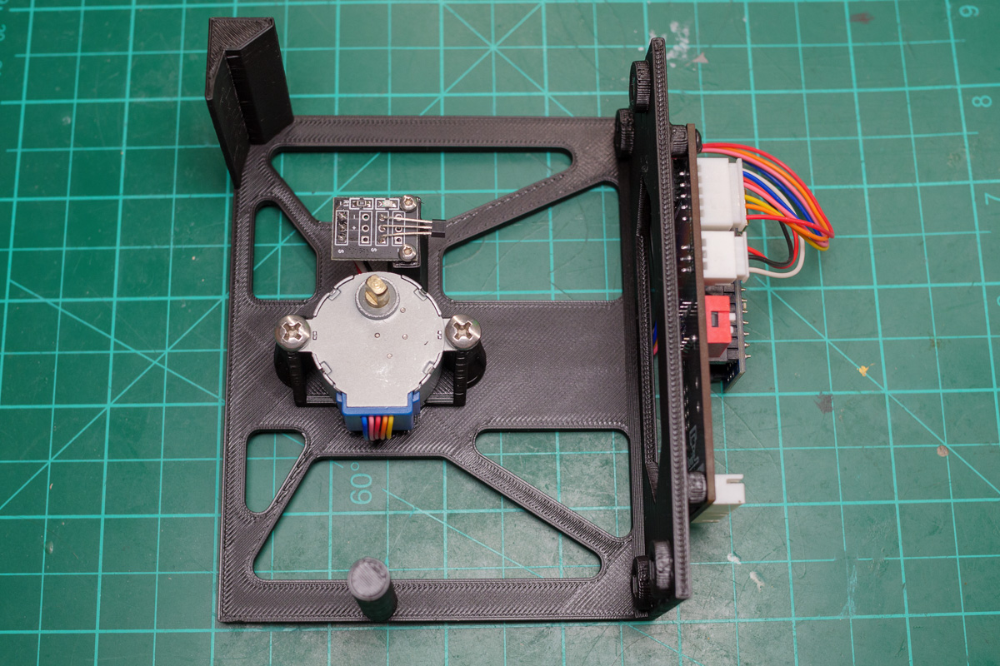

**Figure 11:** FrameUnit Top View

Push two M3 nuts diagonally in the back of the frame. Use a screw to pull the nut if necessary.

Mount the hall sensor and stepper.

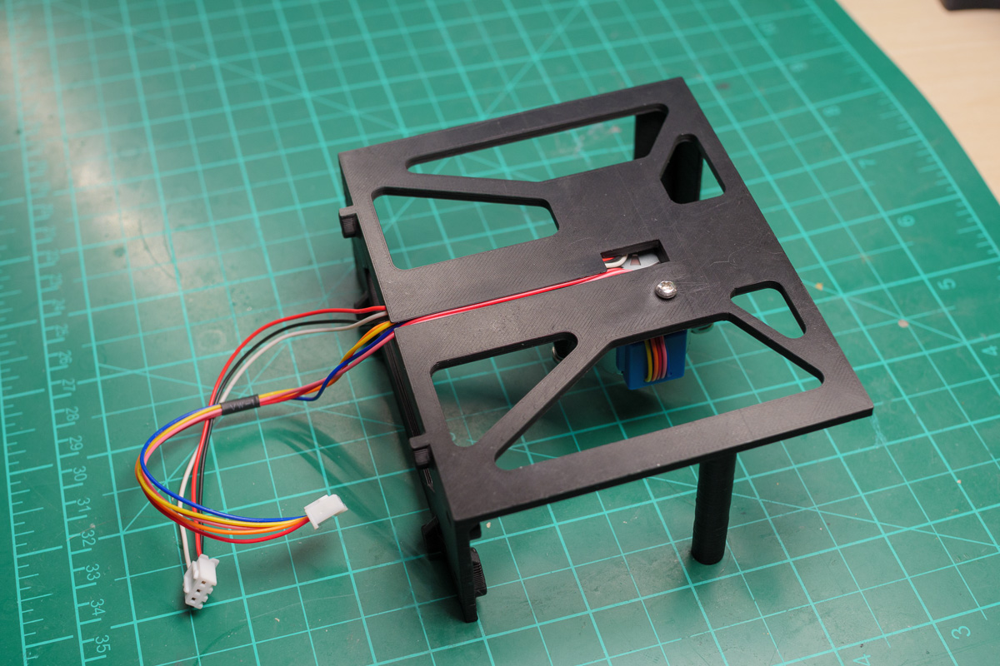

**Figure 12:** FrameUnit Cable Management

Route the cables through the back and push them in the channel.

Mount the PCB with two screws and plug in the hall sensor and stepper.

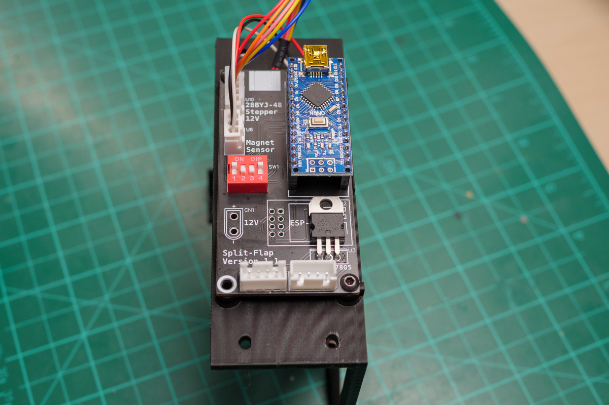

**Figure 13:** FrameUnit Back Side

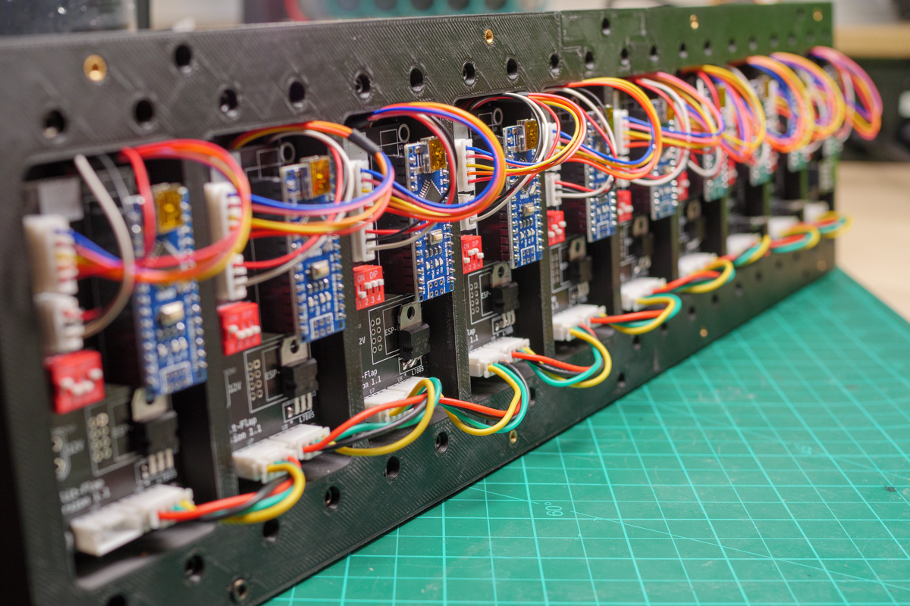

**Figure 14:** Units mounted to MiddleFrame

Repeat this for all units.

### 5.3 Case

#### 5.3.1 MiddleFrame

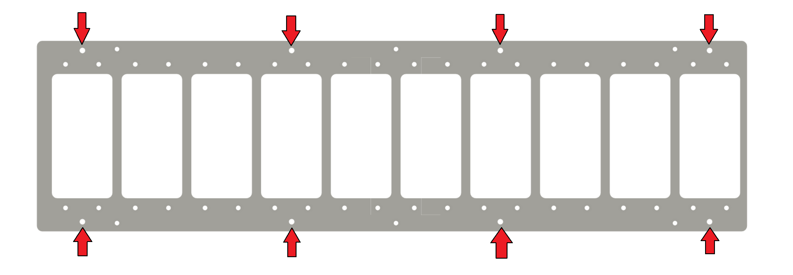

**Figure 15:** Insert position on MiddleFrame pieces

Insert eight M3 inserts as indicated in the picture with your soldering iron and connect the 3 pieces with the correct screw and nut.

#### 5.3.2 FrontCover

Insert six M3 inserts with your soldering iron and connect the 3 pieces with the correct screw and nut.

#### 5.3.3 BackCover

Connect the 3 pieces with the correct screw and nut. Insert the power switch and DC socket into their holes and connect them to a XH-4Y plug.

---

## 6 Code

**Github link to code and tutorial how to set everything up:**  
https://github.com/Dave19171/split-flap

---

*End of Instructions*
